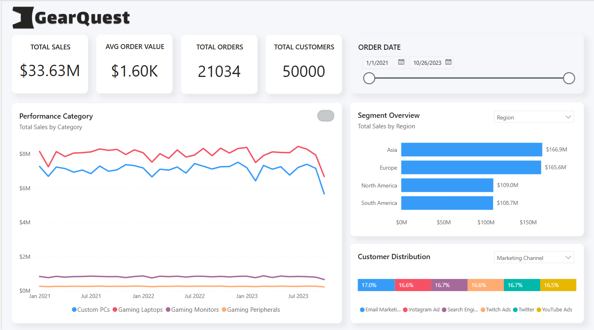

# Sales Pipeline ETL & Tableau Dashboard: GearQuest Analysis

This project demonstrates the process of extracting, transforming, and loading (ETL) data from Excel files into a .hyper Tableau extract file. This approach facilitates seamless data integration within Tableau, enabling enhanced business intelligence visualizations and dashboard creation.

## Dashboard Preview


📊 **[View Interactive Dashboard](https://app.powerbi.com/view?r=eyJrIjoiNmYyZjMyNWMtYmE1OS00MjRlLWIxMzAtZjJlMmU4ZWQ4NmFhIiwidCI6IjVkNGNmODgzLTJlMzQtNGZlNi04ZDExLWE0ZWE5NTk0ZTQ0YyIsImMiOjF9)** - Explore the live dashboard on Power BI

---

## Project Structure

### **Data Pipeline**

1.  **Data Extraction**: Extracts data from multiple Excel files (Orders, Order Status, Products, Geo Lookup, and Customers) using Pandas.
2.  **Data Transformation**:
    -   Integrates data from multiple tables using Pandas' merge function.
    -   Ensures that missing values are compatible with Tableau by converting all np.nan entries to None (which maps to SQL NULL).
    -   Converts specific numeric columns to the Decimal type, as this precise format is required by Tableau Hyper for inserting rows into the tables accurately.
3.  **Data Loading**: Loads the transformed data into a Tableau Hyper extract file (`.hyper`) using the `tableauhyperapi` library.

### **Key Steps**

-   **Data Loading**: Loads data from Excel files into Pandas DataFrames.
-   **Combining Tables**: Merges related tables (Orders + Order Status, Customers + Geo Lookup) to create combined DataFrames.
-   **Data Type Handling**: Inspects and adjusts data types as necessary for compatibility with Tableau Hyper format. Converts relevant columns to Decimal.
-   **Export to .hyper**: Creates a `.hyper` file and inserts the transformed data into the respective tables.

---

## Installation and Setup

1.  **Clone the repository:**

    ```bash
    git clone <repository_url>
    cd <repository_directory>
    ```

2.  **Create a virtual environment (optional but recommended):**

    ```bash
    python3 -m venv venv
    source venv/bin/activate
    ```

3.  **Install dependencies:**

    ```bash
    pip install pandas numpy tableauhyperapi
    ```

4.  **Run the notebook:**

    ```bash
    jupyter notebook etl_to_hyper.ipynb
    ```

---

## Data Source


The data used in this project is sourced from the [GearQuest Sales and Customer Insights Dataset on Kaggle](https://www.kaggle.com/datasets/dipunmohapatra/gearquest-sales-and-customer-insights-dataset). The dataset consists of several Excel files: Orders.xlsx, Order\_Status.xlsx, Products.xlsx, Geo\_lookup.xlsx, and Customers.xlsx. These files should be placed in the \`data/raw/\` directory.

**Note:** These files are assumed to be available and are not included in this repository. Please download them from the Kaggle link provided.

---

## Interactive Dashboards (Planned)

The goal of this project is to enable the creation of interactive dashboards in Tableau using the generated `.hyper` file. These dashboards will provide insights into the GearQuest sales pipeline and related data.